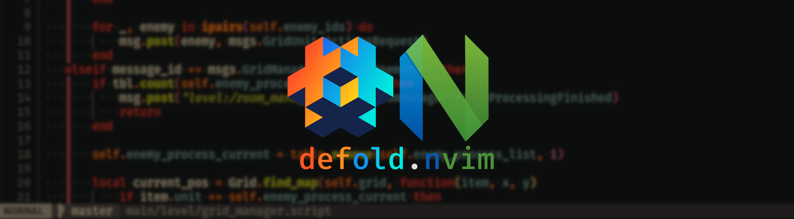

# defold.nvim

Batteries-included development environment for the [Defold game engine](https://defold.com), powered by [Neovim](https://neovim.io/)


## Features

- **Code Hot-Reloading**: Make code tweaks and see them live in Defold, no waiting.
- **Defold Control from Neovim**: Run Defold commands right from Neovim with custom shortcuts.
- **LSP Integration**: Get Defold API hints and autocomplete in Neovim’s built-in LSP.
- **Dependency Annotations**: Auto-load LSP annotations for your Defold dependencies.
- **Debugger**: Step through your code and dig into issues with ease.
- **Snippets**: Insert pre-made code snippets to save time.

## System Requirements

### Operating System

- Linux 🐧   - First class & fully supported
- MacOS 🍎   - Experimental, both ARM and Intel Macs are supported
- Windows 🪟 - Experimental

### Launchers

Since Neovim is a terminal based application it has to be run through something, by default we do this through [Neovide](https://neovide.dev/) or a terminal

**Note**: While optional, I'd recommend you to have Neovide installed and available in your PATH

#### Supported Terminals

These are the terminal supported by default (when you just switch the launcher type to "terminal")

- [ghostty](https://ghostty.org/)
- [kitty](https://sw.kovidgoyal.net/kitty/)
- [alacritty](https://alacritty.org/)
- [foot](https://codeberg.org/dnkl/foot)
- [st](https://st.suckless.org/)

You can use any other terminal by changing the launcher options to the following:

```lua
    -- ...

    launcher = {
        type = "terminal",

        executable = "/usr/bin/my-custom-terminal",

        terminal = {
            class_argument = "--app-id=",
            run_argument = "-e",
        },
    },

    -- ...
```

## Install

### Lazy.nvim

```lua
{
    "atomicptr/defold.nvim",
    lazy = false,

    -- (Optional) Required when using the debugger
    dependencies = {
        "mfussenegger/nvim-dap",
    },

    -- This makes sure the native library downloads at installation
    build = function()
        require("defold").download()
    end,

    opts = {
        -- config options, see below
    },
}
```

### Other

defold.nvim utilizes lazy loading backed into the plugin, so all you gotta do is call our `.setup(opts)` function to use it

```lua
local defold = require "defold"
defold.setup(config) -- config options, see below
```

## Configuration

```lua
local config = {
    defold = {
        -- Automatically set defold.nvim as the default editor in Defold (default: true)
        set_default_editor = true,

        -- Automatically fetch dependencies on launch (default: true)
        auto_fetch_dependencies = true,

        -- Enable hot reloading when saving scripts in Neovim (default: true)
        hot_reload_enabled = true,
    },


    launcher = {
        -- How to run neovim "neovide" or "terminal" (default: neovide)
        type = "neovide",

        -- path to your neovim or terminal executable (optional)
        executable = nil,

        -- extra arguments passed to the `executable` (or neovide)
        extra_arguments = nil,

        -- choose file based sockets (fsock, unix only) or network based sockets (netsock) or use nil for the default
        socket_type = nil,

        -- configure how the terminal is run (optional)
        terminal = {
            -- argument to define how to set the class name of the terminal, usually something like "--class="
            class_argument = nil,

            -- argument to define how to run neovim, usually "-e"
            run_argument = nil,
        }
    },

    debugger = {
        -- Enable the debugger (default: true)
        enable = true,

        -- Use a custom executable for the debugger (default: nil)
        custom_executable = nil,

        -- Add custom arguments to the debugger (default: nil)
        custom_arguments = nil,
    },

    -- setup keymaps for Defold actions
    keymaps = {

        -- build (& run) action
        build = {
            -- make this available in normal and insert mode
            mode = { "n", "i" },

            -- run via Ctrl+b
            mapping = "<C-b>",
        },
    },

    -- Force the plugin to be always enabled (even if we can't find the game.project file) (default: false)
    force_plugin_enabled = false,
}

local defold = require "defold"
defold.setup(config)
```

## Setup

### Setup Neovim

By installing and running the plugin once, Defold should automatically use Neovim as its editor. (Unless you disabled the setting above)

If you manually want to setup Defold, run `:SetupDefold`

### Setup Debugging

For debugging we're using [mobdap](https://github.com/atomicptr/mobdap) which is running on top of [MobDebug](https://github.com/pkulchenko/MobDebug) so you need to have that available
in your project.

The easiest way is using [defold-mobdebug](https://github.com/atomicptr/defold-mobdebug) in your project.

[(Read this)](https://github.com/atomicptr/defold-mobdebug?tab=readme-ov-file#installation)

And then you run use ``:DapNew`` and the game should be running

### Setup Snippets

In order to use snippets you need to either have [LuaSnip](https://github.com/L3MON4D3/LuaSnip) installed or use any other VSCode Snippet compatible plugin and set it up yourself

You can retrieve the plugin root via:

```lua
local defold = require "defold"
local root = defold.plugin_root()
```

## Available Commands

Here's how you can interact with Defold directly from Neovim:

* **:Defold**
    This commands starts vim.ui.select to let you select a Defold command to run

* **:DefoldSend `<command>`**
    This command lets you send any arbitrary command directly to your Defold editor. Use this for scripting or keybindings. For example, use **`:DefoldSend build`** to trigger build & run.

* **:DefoldFetch**
    This command fetches all Defold dependencies and creates annotations for the Lua LSP. Run with bang to force re-downloading the annotations.

* **:SetupDefold**
    This commands does the required setup for Defold to use Neovim as its external editor (this will be done by default unless disabled, see config above)

## Special Thanks

- [astrochili/defold-annotations](https://github.com/astrochili/defold-annotations)

## License

GPLv3
