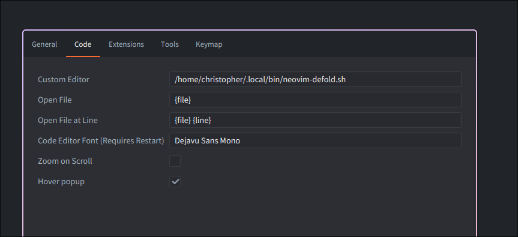

# defold.nvim

Use Neovim as your external editor for the [Defold game engine](https://defold.com).

## Features

- **Code Hot-Reloading**: Instantly see code changes reflected in Defold.
- **Defold Control via Neovim**: Execute Defold commands directly from Neovim using custom user commands.
- **LSP Integration**: Leverage Defold API annotations within Neovim's Language Server Protocol
- **Dependency Annotations**: Automatically provide LSP annotations for Defold dependencies

## System Requirements

This plugin is designed for Linux environments, though it might function on macOS (untested).

This plugin is using [Babashka](https://babashka.org) internally to circumvent Neovim Luas API limitations.
If you do not have Babashka installed on your system, the plugin will download and manage its own local copy
which will however add a few more requirements.

If you have Babashka installed you'll only need either lsof, ss or netstat

If not, we'll also need curl and tar in addition

## Install

### Lazy.nvim

```lua
{
    "atomicptr/defold.nvim",

    -- this will make sure this plugin only loads when you are in a defold project
    cond = function()
        local root_dir = vim.fs.root(0, { "game.project", ".git" })
        if root_dir == nil then
            return false
        end
        return vim.fn.filereadable(root_dir .. "/game.project") == 1
    end,

    -- configuration
    opts = {
        -- enables code hot reloading (default: true)
        hot_reload_enabled = true,

        -- enables the plugin to automatically fetch & annotate your project dependencies (default: true)
        auto_fetch_dependencies = true,
    }
}
```

## Setup Neovim

Copy [neovim-defold.sh](./neovim-defold.sh) into your path and set it up in Defold like this:

In Defold head to **File** > **Preferences** > **Code**



## Available Commands

Here's how you can interact with Defold directly from Neovim:

* **:Defold**
    This commands starts vim.ui.select to let you select a Defold command to run

* **:DefoldSend `<command>`**
    This command lets you send any arbitrary command directly to your Defold editor. Use this for scripting or keybindings. For example, use **`:DefoldSend build`** to trigger build & run.

* **:DefoldFetch**
    This command fetches all Defold dependencies and creates annotations for the Lua LSP. Run with bang to force re-downloading the annotations.

## Special Thanks

- [astrochili/defold-annotations](https://github.com/astrochili/defold-annotations)

## License

GPLv3
